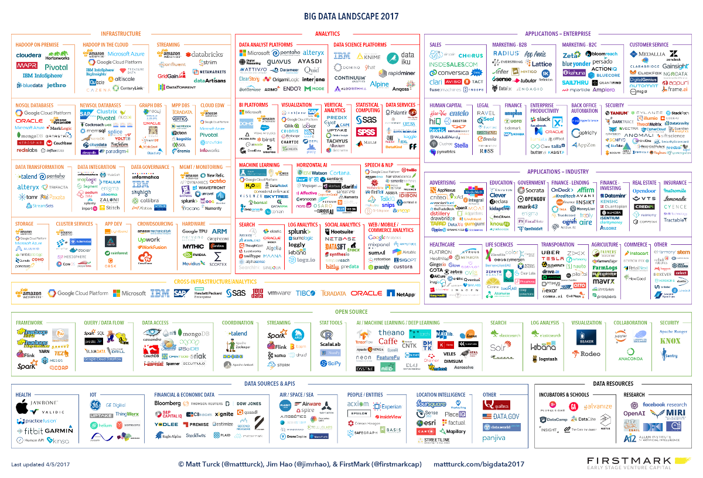

# Codemotion 2017

---

## Areas de exploración

* DataScience && BigData
* Seguridad
* Web
* DevOps
* Other

---

# DataScience && BigData


---

## Haz que tus datos sean sexys

----

Taller de data science

* Apache Spark
* [ Jupyter  ](http://jupyter.org/)
* Python/Scala
* Docker
* [ K-means ](https://es.wikipedia.org/wiki/K-means)

Note: Cosas que aprendí: no se lo preparon muy bien

---

## Streaming Data : ni pierdas el tren, ni esperes en balde

### [ Presentación ](https://speakerdeck.com/galderz/streaming-data-ni-pierdas-el-tren-ni-esperes-en-balde)

----


Note: OpenShift == Kubernetes con esteroides

----


---

## Diseñando arquitecturas: Big Data + tiempo real

----



----

* Hadoop como almacen y explotación de históricos

* Importación/Exportación:
  * Sqoop

* Explotación:
  * MapReduce
  * Hive
  * Impala
  * Pig

----

* Ingestas de eventos:
  * Nifi
  * **Kafka** <- Hype
  * Flume

* Explotación de eventos:
  * Solr
  * elastic

---

# Seguridad


---

## ¡Ataca tus aplicaciones antes que los malos!

----

* Casi nadie programa pensando en la seguridad
* Pruebas de seguridad
* Fuzzing
* Cuidado con las credenciales...
* OWASP Top 10

Note: Fuzzing: técnica para encontrar errores en aplicaciones proveyendolos de información incorrecta de manera automática

---

## Anatomy of a DDOS

----

* Ataque DDOS a DNSSimple
* DNS es especialmente vulnerable al estar basado en UDP
* Ataque DNS flooding
* Disponian de hardware especializado contra DDOS pero no sirvio de nada...
* Transparencia con el cliente
* No pudieron combatirlo

Note: Al final se pasaron a cloudfare

---

## Hacking de aplicaciones con node.js for fun and profit

[Charla](https://www.youtube.com/watch?v=z4x_3gI6rq0)

----

Vulnerabilidades

* Global Namespace Pollution
* HTTP Parameter Pollution
  * OS Commanding
* Remote command execution (eval)
  * RegexDoS
  * Inyección SQL, NoSQL, HTML, XSS
  * Directory transversal
  * Serialización y transporte inseguro

---

# Web


---

## Clean Architecture

[Charla](https://www.youtube.com/watch?v=Lha1hPvVM4M)

----

* Repaso a las distintas arquitecturas
* Layered
* Event Driven
* Plugin
* Microservices
  * Hexagonal
  * Clean (Parecido al hexagonal)
* Space-Based (Acerca la capa de persistencia a la aplicación)

---

## Sobrevive al inframundo de los tests end-to-end

[Charla](https://www.youtube.com/watch?v=GgJeAe90H1w)

----

* Programar la interacción de usuario es dificil
* Son frágiles debido a la alta dependencia
* Gherkin, permite implicar al equipo completo
* Aconseja a veces hacer trampas usando variables de entorno para agilizar los tests en local
* Patrón PageObject

```
HomePage.tapAddressButton()
```

Note: Pone el ejemplo de una interacción de usuario que fallaba por una animación que el test no salia por ejecutar el evento demasiado rápido.
  Aunque permite implicar al equipo completo mejor que sea supervisado por alguien con conocimientos de desarrollo
  El patrón PageObject permite

---

## Component-Driven Development with React ⚛️

  [ Charla ]( https://www.youtube.com/watch?v=CWPXp0XyjI0 )

----

  * Components Explorer
  * Storybook
  * Vue-play

---

## GraphQL ha muerto: Vivan las APIs REST con Hypermedia

[ Charla ](https://www.youtube.com/watch?v=ud1fWXACWm0)

----

  * Identificar necesidades y luego pensar en herramientas
  * APIs evolutivas (evolvable-apis.org)
  * Los clientes son muy simples (Game Loop)
  * Shared Vocabularies schema.org

----

### Paginación con Hypermedia

  ```json
{
  "_embedded": { ... },
    "total": 43,
    "count": 30,
    "_links": {
      "first": {
        "href": "http://service/o/p/groups?page=1&per_page=30"
      },
      "next": {
        "href": "http://service/o/p/groups?page=2&per_page=30"
      },
      "last": {
        "href": "http://service/o/p/groups?page=2&per_page=30"
      }
    }
}
```

----

### Acciones con Hypermedia

```json
{
  "properties": { "title": "Hypermedia is awesome" },
    "actions": [{
      "name": "delete-item",
      "title": "Delete Blog Posting"
        "method": "DELETE",
      "href": "http://service/o/p/blogs/abcdef"
    },{
      "name": "publish",
      "title": "Publish Blog Posting",
      "method": "POST",
      "href": "http://service/o/p/123URL4123AREabcdef"
    }]
}
```

---

# DevOps


---

## Chasing the perfect CI/CD Pipeline – Create applications in the future at adidas

----

* Jenkins pipeline
* Kubernetes
* Terraform (IaC)
* Control de versiones de arquitecturas
* Métricas de sistemas y **procesos**

---

## ChatOps, o cómo hacer DevOps desde Slack

----

* Muy útil para mantener a la gente informada de lo que se hace
* Fácil de aprender la operativa para alguien nuevo
* Dificultad de gestionar la abundancia de información

---

# Other


---

## Peopleware

  Los proyectos fracasan por las personas y no por limitaciones técnicas

  [Charla](https://www.youtube.com/watch?v=1s8NFUNFaT0)

---

# Gracias!
